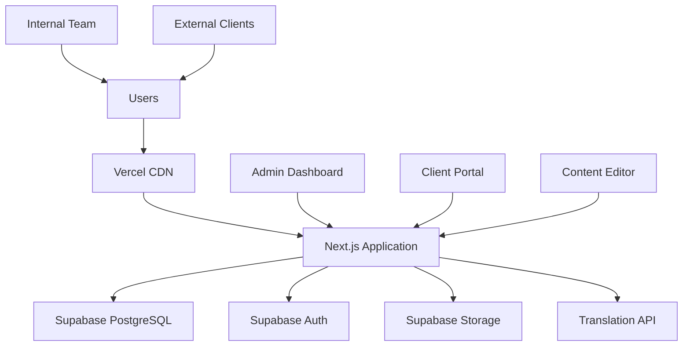
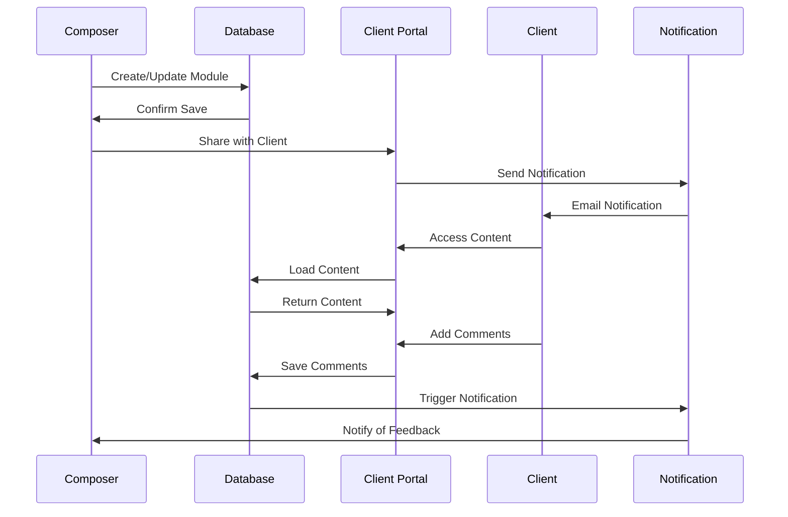
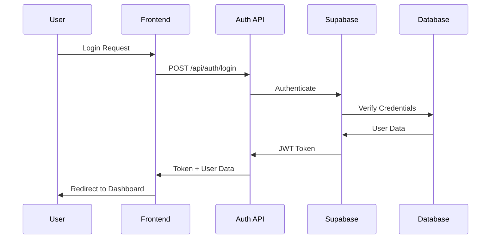
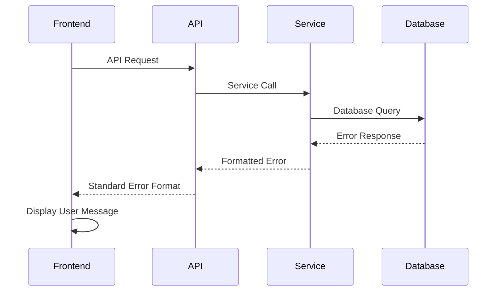

# Course Tracker Full-Stack Architecture Document

## Introduction

This document outlines the complete full-stack architecture for Course Tracker, including backend systems, frontend implementation, and their integration. It serves as the single source of truth for AI-driven development, ensuring consistency across the entire technology stack.

This unified approach combines what would traditionally be separate backend and frontend architecture documents, streamlining the development process for modern full-stack applications where these concerns are increasingly intertwined.

### Starter Template or Existing Project
N/A - Greenfield project with simple, maintainable architecture

### Change Log
| Date | Version | Description | Author |
|------|---------|-------------|---------|
| 2025-01-25 | 1.0 | Initial architecture design | Winston (Architect) |

## High Level Architecture

### Technical Summary
Course Tracker will be built as a monolithic full-stack web application using Next.js for both frontend and backend functionality. The application will use PostgreSQL for data persistence, implement role-based authentication for internal team members and external clients, and integrate with external translation APIs for multi-language support. This architecture prioritizes simplicity and maintainability while supporting the training programme hierarchy (programmes → courses → modules → units) and client engagement workflows.

### Platform and Infrastructure Choice
**Platform:** Vercel + Supabase
**Key Services:** Vercel (hosting, serverless functions), Supabase (PostgreSQL database, authentication, file storage)
**Deployment Host and Regions:** Vercel global CDN with primary region in Europe

**Rationale:** This combination provides rapid development capabilities, automatic scaling, and excellent developer experience while keeping infrastructure simple and cost-effective for a small team.

### Repository Structure
**Structure:** Monorepo with Next.js app
**Monorepo Tool:** Built-in Next.js structure (no additional tooling needed)
**Package Organization:** Single application with clear folder organization

### High Level Architecture Diagram


### Architectural Patterns
- **Jamstack Architecture:** Next.js with serverless API routes - _Rationale:_ Optimal performance and scalability for content-heavy applications
- **Component-Based UI:** Reusable React components with TypeScript - _Rationale:_ Maintainability and type safety across large codebases
- **Repository Pattern:** Abstract data access logic - _Rationale:_ Enables testing and future database migration flexibility
- **Role-Based Access Control:** Separate interfaces for internal vs external users - _Rationale:_ Security and user experience optimization

## Tech Stack

### Technology Stack Table
| Category | Technology | Version | Purpose | Rationale |
|----------|------------|---------|---------|-----------|
| Frontend Language | TypeScript | 5.x | Type-safe development | Prevents runtime errors and improves developer experience |
| Frontend Framework | Next.js | 14.x | Full-stack React framework | Server-side rendering, API routes, and excellent developer experience |
| UI Component Library | shadcn/ui | Latest | Pre-built accessible components | High-quality components with customization flexibility |
| State Management | React Context + useState | Built-in | Simple state management | Sufficient for application complexity, no external dependencies |
| Backend Language | TypeScript | 5.x | Consistent language across stack | Shared types and reduced context switching |
| Backend Framework | Next.js API Routes | 14.x | Serverless API endpoints | Integrated with frontend, automatic deployment |
| API Style | REST API | - | Standard HTTP endpoints | Simple, well-understood, easy to test |
| Database | PostgreSQL | 15.x | Relational database | Strong consistency, complex queries, excellent tooling |
| Cache | Built-in Next.js | 14.x | Page and API caching | Automatic optimization without additional complexity |
| File Storage | Supabase Storage | Latest | File uploads and media | Integrated with database, automatic CDN |
| Authentication | Supabase Auth | Latest | User authentication and authorization | Built-in JWT, social logins, role management |
| Frontend Testing | Jest + React Testing Library | Latest | Component and unit testing | Industry standard, excellent React integration |
| Backend Testing | Jest + Supertest | Latest | API endpoint testing | Simple HTTP testing, consistent with frontend |
| E2E Testing | Playwright | Latest | End-to-end user workflows | Reliable, fast, excellent debugging tools |
| Build Tool | Next.js | 14.x | Integrated build system | Zero configuration, optimized builds |
| Bundler | Webpack (via Next.js) | Latest | Module bundling | Integrated, optimized for React applications |
| IaC Tool | Vercel CLI | Latest | Deployment configuration | Simple deployment, environment management |
| CI/CD | GitHub Actions | Latest | Automated testing and deployment | Free for public repos, excellent GitHub integration |
| Monitoring | Vercel Analytics | Latest | Performance and error monitoring | Integrated with hosting platform |
| Logging | Console + Vercel Logs | Built-in | Application logging | Simple, integrated solution |
| CSS Framework | Tailwind CSS | 3.x | Utility-first styling | Rapid development, consistent design system |

## Data Models

### User
**Purpose:** Represents all system users (internal team members and external clients)

**Key Attributes:**
- id: UUID - Unique identifier
- email: string - User email address
- role: enum - User role (composer, principal, client, admin)
- name: string - Full name
- organization: string - Company/organization name
- created_at: timestamp - Account creation date
- last_login: timestamp - Last login time

#### TypeScript Interface
```typescript
interface User {
  id: string;
  email: string;
  role: 'composer' | 'principal' | 'client' | 'admin';
  name: string;
  organization?: string;
  created_at: string;
  last_login?: string;
}
```

#### Relationships
- One-to-many with TrainingProgramme (as creator)
- Many-to-many with TrainingProgramme (as collaborator)
- One-to-many with Comment (as author)

### TrainingProgramme
**Purpose:** Top-level container for complete training programmes

**Key Attributes:**
- id: UUID - Unique identifier
- title: string - Programme title
- description: text - Programme description
- status: enum - Current status (draft, in_review, approved, published)
- client_id: UUID - Associated client
- created_by: UUID - Creator user ID
- created_at: timestamp - Creation date
- updated_at: timestamp - Last update

#### TypeScript Interface
```typescript
interface TrainingProgramme {
  id: string;
  title: string;
  description: string;
  status: 'draft' | 'in_review' | 'approved' | 'published';
  client_id: string;
  created_by: string;
  created_at: string;
  updated_at: string;
}
```

#### Relationships
- One-to-many with Course
- Many-to-one with User (client)
- Many-to-one with User (creator)

### Course
**Purpose:** Major sections within a training programme

**Key Attributes:**
- id: UUID - Unique identifier
- programme_id: UUID - Parent programme
- title: string - Course title
- description: text - Course description
- order_index: integer - Display order
- status: enum - Current status

#### TypeScript Interface
```typescript
interface Course {
  id: string;
  programme_id: string;
  title: string;
  description: string;
  order_index: number;
  status: 'draft' | 'in_review' | 'approved' | 'published';
}
```

#### Relationships
- Many-to-one with TrainingProgramme
- One-to-many with Module

### Module
**Purpose:** Individual learning modules within courses

**Key Attributes:**
- id: UUID - Unique identifier
- course_id: UUID - Parent course
- title: string - Module title
- content: text - Module content (rich text)
- order_index: integer - Display order
- language: string - Content language

#### TypeScript Interface
```typescript
interface Module {
  id: string;
  course_id: string;
  title: string;
  content: string;
  order_index: number;
  language: string;
  status: 'draft' | 'in_review' | 'approved' | 'published';
}
```

#### Relationships
- Many-to-one with Course
- One-to-many with Unit
- One-to-many with Comment

### Unit
**Purpose:** Smallest content units within modules

**Key Attributes:**
- id: UUID - Unique identifier
- module_id: UUID - Parent module
- title: string - Unit title
- content: text - Unit content
- order_index: integer - Display order
- duration_minutes: integer - Estimated completion time

#### TypeScript Interface
```typescript
interface Unit {
  id: string;
  module_id: string;
  title: string;
  content: string;
  order_index: number;
  duration_minutes?: number;
}
```

#### Relationships
- Many-to-one with Module

### Comment
**Purpose:** Feedback and collaboration comments on content

**Key Attributes:**
- id: UUID - Unique identifier
- content_id: UUID - Associated content (module or unit)
- content_type: enum - Type of content being commented on
- author_id: UUID - Comment author
- message: text - Comment content
- status: enum - Comment status (open, resolved)

#### TypeScript Interface
```typescript
interface Comment {
  id: string;
  content_id: string;
  content_type: 'module' | 'unit';
  author_id: string;
  message: string;
  status: 'open' | 'resolved';
  created_at: string;
}
```

#### Relationships
- Many-to-one with User (author)
- Many-to-one with Module or Unit (content)

## API Specification

### REST API Specification
```yaml
openapi: 3.0.0
info:
  title: Course Tracker API
  version: 1.0.0
  description: API for Course Tracker training programme management platform
servers:
  - url: https://course-tracker.vercel.app/api
    description: Production server
  - url: http://localhost:3000/api
    description: Development server

paths:
  /programmes:
    get:
      summary: Get all training programmes
      security:
        - bearerAuth: []
      responses:
        '200':
          description: List of training programmes
          content:
            application/json:
              schema:
                type: array
                items:
                  $ref: '#/components/schemas/TrainingProgramme'
    post:
      summary: Create new training programme
      security:
        - bearerAuth: []
      requestBody:
        required: true
        content:
          application/json:
            schema:
              $ref: '#/components/schemas/CreateTrainingProgramme'
      responses:
        '201':
          description: Programme created successfully

  /programmes/{id}/courses:
    get:
      summary: Get courses for a programme
      parameters:
        - name: id
          in: path
          required: true
          schema:
            type: string
      responses:
        '200':
          description: List of courses
          content:
            application/json:
              schema:
                type: array
                items:
                  $ref: '#/components/schemas/Course'

  /courses/{id}/modules:
    get:
      summary: Get modules for a course
      parameters:
        - name: id
          in: path
          required: true
          schema:
            type: string
      responses:
        '200':
          description: List of modules

  /modules/{id}/translate:
    post:
      summary: Translate module content
      parameters:
        - name: id
          in: path
          required: true
          schema:
            type: string
      requestBody:
        required: true
        content:
          application/json:
            schema:
              type: object
              properties:
                target_language:
                  type: string
                  enum: [nl, fr, zh-CN]
      responses:
        '200':
          description: Translation completed

components:
  schemas:
    TrainingProgramme:
      type: object
      properties:
        id:
          type: string
        title:
          type: string
        description:
          type: string
        status:
          type: string
          enum: [draft, in_review, approved, published]
        client_id:
          type: string
        created_at:
          type: string
          format: date-time
  securitySchemes:
    bearerAuth:
      type: http
      scheme: bearer
      bearerFormat: JWT
```

## Components

### Authentication Service
**Responsibility:** Handles user authentication, authorization, and session management

**Key Interfaces:**
- User login/logout
- Role-based access control
- JWT token management

**Dependencies:** Supabase Auth

**Technology Stack:** Supabase Auth SDK, Next.js middleware for route protection

### Content Management Service
**Responsibility:** Manages training programme content hierarchy and CRUD operations

**Key Interfaces:**
- Programme/Course/Module/Unit CRUD
- Content versioning
- Search and filtering

**Dependencies:** Database service, File storage service

**Technology Stack:** Next.js API routes, PostgreSQL, Supabase client

### Translation Service
**Responsibility:** Handles content translation to multiple languages

**Key Interfaces:**
- Automatic translation requests
- Translation quality tracking
- Language management

**Dependencies:** External translation API (Google Translate)

**Technology Stack:** Google Translate API, Next.js API routes

### Client Portal Service
**Responsibility:** Provides client-specific interfaces and functionality

**Key Interfaces:**
- Client dashboard
- Content review and feedback
- Approval workflows

**Dependencies:** Authentication service, Content management service

**Technology Stack:** Next.js pages, role-based routing, React components

### Comment System Service
**Responsibility:** Manages feedback and collaboration features

**Key Interfaces:**
- Comment creation and threading
- Notification system
- Comment resolution workflow

**Dependencies:** Authentication service, Content management service

**Technology Stack:** PostgreSQL, Next.js API routes, real-time updates

## External APIs

### Google Translate API
- **Purpose:** Automatic translation of content to Dutch, French, and Simplified Chinese
- **Documentation:** https://cloud.google.com/translate/docs
- **Base URL(s):** https://translation.googleapis.com/language/translate/v2
- **Authentication:** API Key
- **Rate Limits:** 100 requests per second, 100,000 characters per day (free tier)

**Key Endpoints Used:**
- `POST /language/translate/v2` - Translate text content
- `GET /language/translate/v2/languages` - Get supported languages

**Integration Notes:** Will be used for initial translation with manual review workflow

## Core Workflows

### Content Creation and Client Review Workflow


## Database Schema

```sql
-- Users table
CREATE TABLE users (
  id UUID PRIMARY KEY DEFAULT gen_random_uuid(),
  email VARCHAR(255) UNIQUE NOT NULL,
  role VARCHAR(50) NOT NULL CHECK (role IN ('composer', 'principal', 'client', 'admin')),
  name VARCHAR(255) NOT NULL,
  organization VARCHAR(255),
  created_at TIMESTAMP WITH TIME ZONE DEFAULT NOW(),
  last_login TIMESTAMP WITH TIME ZONE
);

-- Training programmes table
CREATE TABLE training_programmes (
  id UUID PRIMARY KEY DEFAULT gen_random_uuid(),
  title VARCHAR(255) NOT NULL,
  description TEXT,
  status VARCHAR(50) NOT NULL DEFAULT 'draft' CHECK (status IN ('draft', 'in_review', 'approved', 'published')),
  client_id UUID REFERENCES users(id),
  created_by UUID REFERENCES users(id),
  created_at TIMESTAMP WITH TIME ZONE DEFAULT NOW(),
  updated_at TIMESTAMP WITH TIME ZONE DEFAULT NOW()
);

-- Courses table
CREATE TABLE courses (
  id UUID PRIMARY KEY DEFAULT gen_random_uuid(),
  programme_id UUID REFERENCES training_programmes(id) ON DELETE CASCADE,
  title VARCHAR(255) NOT NULL,
  description TEXT,
  order_index INTEGER NOT NULL,
  status VARCHAR(50) NOT NULL DEFAULT 'draft' CHECK (status IN ('draft', 'in_review', 'approved', 'published')),
  created_at TIMESTAMP WITH TIME ZONE DEFAULT NOW()
);

-- Modules table
CREATE TABLE modules (
  id UUID PRIMARY KEY DEFAULT gen_random_uuid(),
  course_id UUID REFERENCES courses(id) ON DELETE CASCADE,
  title VARCHAR(255) NOT NULL,
  content TEXT,
  order_index INTEGER NOT NULL,
  language VARCHAR(10) NOT NULL DEFAULT 'en',
  status VARCHAR(50) NOT NULL DEFAULT 'draft' CHECK (status IN ('draft', 'in_review', 'approved', 'published')),
  created_at TIMESTAMP WITH TIME ZONE DEFAULT NOW(),
  updated_at TIMESTAMP WITH TIME ZONE DEFAULT NOW()
);

-- Units table
CREATE TABLE units (
  id UUID PRIMARY KEY DEFAULT gen_random_uuid(),
  module_id UUID REFERENCES modules(id) ON DELETE CASCADE,
  title VARCHAR(255) NOT NULL,
  content TEXT,
  order_index INTEGER NOT NULL,
  duration_minutes INTEGER,
  created_at TIMESTAMP WITH TIME ZONE DEFAULT NOW()
);

-- Comments table
CREATE TABLE comments (
  id UUID PRIMARY KEY DEFAULT gen_random_uuid(),
  content_id UUID NOT NULL,
  content_type VARCHAR(50) NOT NULL CHECK (content_type IN ('module', 'unit')),
  author_id UUID REFERENCES users(id),
  message TEXT NOT NULL,
  status VARCHAR(50) NOT NULL DEFAULT 'open' CHECK (status IN ('open', 'resolved')),
  created_at TIMESTAMP WITH TIME ZONE DEFAULT NOW()
);

-- Indexes for performance
CREATE INDEX idx_training_programmes_client_id ON training_programmes(client_id);
CREATE INDEX idx_courses_programme_id ON courses(programme_id);
CREATE INDEX idx_modules_course_id ON modules(course_id);
CREATE INDEX idx_units_module_id ON units(module_id);
CREATE INDEX idx_comments_content ON comments(content_id, content_type);
```

## Frontend Architecture

### Component Architecture

#### Component Organization
```
src/
├── components/
│   ├── ui/                 # shadcn/ui components
│   ├── layout/             # Layout components
│   │   ├── Header.tsx
│   │   ├── Sidebar.tsx
│   │   └── Layout.tsx
│   ├── content/            # Content management components
│   │   ├── ProgrammeList.tsx
│   │   ├── CourseEditor.tsx
│   │   ├── ModuleEditor.tsx
│   │   └── ContentViewer.tsx
│   ├── client/             # Client portal components
│   │   ├── ClientDashboard.tsx
│   │   ├── ReviewInterface.tsx
│   │   └── FeedbackForm.tsx
│   └── common/             # Shared components
│       ├── CommentSystem.tsx
│       └── StatusBadge.tsx
```

#### Component Template
```typescript
import { FC } from 'react';

interface ComponentProps {
  // Props definition
}

export const Component: FC<ComponentProps> = ({ 
  // Props destructuring
}) => {
  return (
    <div>
      {/* Component JSX */}
    </div>
  );
};
```

### State Management Architecture

#### State Structure
```typescript
// Global state using React Context
interface AppState {
  user: User | null;
  currentProgramme: TrainingProgramme | null;
  loading: boolean;
  error: string | null;
}

// Local component state using useState
const [programmes, setProgrammes] = useState<TrainingProgramme[]>([]);
```

#### State Management Patterns
- Use React Context for global state (user, authentication)
- Use useState for local component state
- Use useReducer for complex state logic
- Implement custom hooks for reusable state logic

### Routing Architecture

#### Route Organization
```
pages/
├── index.tsx               # Dashboard
├── programmes/
│   ├── index.tsx          # Programme list
│   ├── [id].tsx           # Programme detail
│   └── new.tsx            # Create programme
├── client/
│   ├── dashboard.tsx      # Client dashboard
│   ├── review/[id].tsx    # Content review
│   └── feedback.tsx       # Feedback center
├── api/                   # API routes
│   ├── programmes/
│   ├── courses/
│   ├── modules/
│   └── auth/
└── _app.tsx               # App wrapper
```

#### Protected Route Pattern
```typescript
import { useAuth } from '@/hooks/useAuth';
import { useRouter } from 'next/router';
import { useEffect } from 'react';

export function withAuth<T>(Component: React.ComponentType<T>, allowedRoles?: string[]) {
  return function AuthenticatedComponent(props: T) {
    const { user, loading } = useAuth();
    const router = useRouter();

    useEffect(() => {
      if (!loading && !user) {
        router.push('/login');
      }
      if (user && allowedRoles && !allowedRoles.includes(user.role)) {
        router.push('/unauthorized');
      }
    }, [user, loading]);

    if (loading || !user) return <div>Loading...</div>;
    
    return <Component {...props} />;
  };
}
```

### Frontend Services Layer

#### API Client Setup
```typescript
// lib/api-client.ts
import { createClient } from '@supabase/supabase-js';

const supabase = createClient(
  process.env.NEXT_PUBLIC_SUPABASE_URL!,
  process.env.NEXT_PUBLIC_SUPABASE_ANON_KEY!
);

export class ApiClient {
  async get<T>(endpoint: string): Promise<T> {
    const { data, error } = await supabase
      .from(endpoint)
      .select('*');
    
    if (error) throw error;
    return data;
  }

  async post<T>(endpoint: string, body: any): Promise<T> {
    const { data, error } = await supabase
      .from(endpoint)
      .insert(body)
      .select();
    
    if (error) throw error;
    return data;
  }
}

export const apiClient = new ApiClient();
```

#### Service Example
```typescript
// services/programme-service.ts
import { apiClient } from '@/lib/api-client';
import { TrainingProgramme } from '@/types';

export class ProgrammeService {
  async getAllProgrammes(): Promise<TrainingProgramme[]> {
    return apiClient.get<TrainingProgramme[]>('training_programmes');
  }

  async createProgramme(data: Partial<TrainingProgramme>): Promise<TrainingProgramme> {
    return apiClient.post<TrainingProgramme>('training_programmes', data);
  }

  async updateProgramme(id: string, data: Partial<TrainingProgramme>): Promise<TrainingProgramme> {
    return apiClient.put<TrainingProgramme>(`training_programmes/${id}`, data);
  }
}

export const programmeService = new ProgrammeService();
```

## Backend Architecture

### Service Architecture

#### API Route Organization
```
pages/api/
├── auth/
│   ├── login.ts
│   ├── logout.ts
│   └── me.ts
├── programmes/
│   ├── index.ts           # GET /api/programmes, POST /api/programmes
│   ├── [id].ts            # GET /api/programmes/[id], PUT, DELETE
│   └── [id]/
│       └── courses.ts     # GET /api/programmes/[id]/courses
├── courses/
│   ├── [id].ts
│   └── [id]/
│       └── modules.ts
├── modules/
│   ├── [id].ts
│   └── [id]/
│       ├── translate.ts   # POST /api/modules/[id]/translate
│       └── comments.ts    # GET, POST /api/modules/[id]/comments
└── translate/
    └── index.ts           # POST /api/translate
```

#### API Route Template
```typescript
// pages/api/programmes/index.ts
import { NextApiRequest, NextApiResponse } from 'next';
import { withAuth } from '@/middleware/auth';
import { programmeService } from '@/services/programme-service';

async function handler(req: NextApiRequest, res: NextApiResponse) {
  switch (req.method) {
    case 'GET':
      try {
        const programmes = await programmeService.getAll();
        res.status(200).json(programmes);
      } catch (error) {
        res.status(500).json({ error: 'Failed to fetch programmes' });
      }
      break;

    case 'POST':
      try {
        const programme = await programmeService.create(req.body);
        res.status(201).json(programme);
      } catch (error) {
        res.status(500).json({ error: 'Failed to create programme' });
      }
      break;

    default:
      res.setHeader('Allow', ['GET', 'POST']);
      res.status(405).end(`Method ${req.method} Not Allowed`);
  }
}

export default withAuth(handler);
```

### Database Architecture

#### Data Access Layer
```typescript
// services/base-repository.ts
import { supabase } from '@/lib/supabase';

export abstract class BaseRepository<T> {
  constructor(protected tableName: string) {}

  async findAll(): Promise<T[]> {
    const { data, error } = await supabase
      .from(this.tableName)
      .select('*');
    
    if (error) throw error;
    return data || [];
  }

  async findById(id: string): Promise<T | null> {
    const { data, error } = await supabase
      .from(this.tableName)
      .select('*')
      .eq('id', id)
      .single();
    
    if (error) throw error;
    return data;
  }

  async create(item: Partial<T>): Promise<T> {
    const { data, error } = await supabase
      .from(this.tableName)
      .insert(item)
      .select()
      .single();
    
    if (error) throw error;
    return data;
  }

  async update(id: string, item: Partial<T>): Promise<T> {
    const { data, error } = await supabase
      .from(this.tableName)
      .update(item)
      .eq('id', id)
      .select()
      .single();
    
    if (error) throw error;
    return data;
  }

  async delete(id: string): Promise<void> {
    const { error } = await supabase
      .from(this.tableName)
      .delete()
      .eq('id', id);
    
    if (error) throw error;
  }
}

// services/programme-repository.ts
export class ProgrammeRepository extends BaseRepository<TrainingProgramme> {
  constructor() {
    super('training_programmes');
  }

  async findByClientId(clientId: string): Promise<TrainingProgramme[]> {
    const { data, error } = await supabase
      .from(this.tableName)
      .select('*')
      .eq('client_id', clientId);
    
    if (error) throw error;
    return data || [];
  }
}
```

### Authentication and Authorization

#### Auth Flow


#### Auth Middleware
```typescript
// middleware/auth.ts
import { NextApiRequest, NextApiResponse } from 'next';
import { supabase } from '@/lib/supabase';

export function withAuth(handler: Function, allowedRoles?: string[]) {
  return async (req: NextApiRequest, res: NextApiResponse) => {
    try {
      const token = req.headers.authorization?.replace('Bearer ', '');
      
      if (!token) {
        return res.status(401).json({ error: 'No token provided' });
      }

      const { data: { user }, error } = await supabase.auth.getUser(token);
      
      if (error || !user) {
        return res.status(401).json({ error: 'Invalid token' });
      }

      // Check role permissions
      if (allowedRoles && !allowedRoles.includes(user.user_metadata.role)) {
        return res.status(403).json({ error: 'Insufficient permissions' });
      }

      // Add user to request
      (req as any).user = user;
      
      return handler(req, res);
    } catch (error) {
      return res.status(500).json({ error: 'Authentication error' });
    }
  };
}
```

## Unified Project Structure

```plaintext
course-tracker/
├── .github/                    # CI/CD workflows
│   └── workflows/
│       ├── ci.yaml
│       └── deploy.yaml
├── components/                 # React components
│   ├── ui/                     # shadcn/ui components
│   ├── layout/                 # Layout components
│   ├── content/                # Content management components
│   ├── client/                 # Client portal components
│   └── common/                 # Shared components
├── pages/                      # Next.js pages and API routes
│   ├── api/                    # Backend API routes
│   │   ├── auth/
│   │   ├── programmes/
│   │   ├── courses/
│   │   ├── modules/
│   │   └── translate/
│   ├── programmes/             # Programme management pages
│   ├── client/                 # Client portal pages
│   ├── _app.tsx                # App wrapper
│   └── index.tsx               # Dashboard
├── lib/                        # Utility libraries
│   ├── supabase.ts             # Supabase client
│   ├── api-client.ts           # API client
│   └── utils.ts                # Shared utilities
├── services/                   # Business logic services
│   ├── programme-service.ts
│   ├── translation-service.ts
│   └── comment-service.ts
├── types/                      # TypeScript type definitions
│   ├── index.ts
│   ├── user.ts
│   └── programme.ts
├── hooks/                      # Custom React hooks
│   ├── useAuth.ts
│   ├── useProgrammes.ts
│   └── useComments.ts
├── middleware/                 # API middleware
│   ├── auth.ts
│   └── error-handler.ts
├── styles/                     # Global styles
│   └── globals.css
├── public/                     # Static assets
├── docs/                       # Documentation
│   ├── prd.md
│   ├── front-end-spec.md
│   └── architecture.md
├── __tests__/                  # Test files
│   ├── components/
│   ├── pages/
│   └── services/
├── .env.local.example          # Environment template
├── package.json                # Dependencies and scripts
├── next.config.js              # Next.js configuration
├── tailwind.config.js          # Tailwind CSS configuration
├── tsconfig.json               # TypeScript configuration
└── README.md
```

## Development Workflow

### Local Development Setup

#### Prerequisites
```bash
# Install Node.js 18+ and npm
node --version  # Should be 18+
npm --version   # Should be 9+

# Install Git
git --version
```

#### Initial Setup
```bash
# Clone repository
git clone <repository-url>
cd course-tracker

# Install dependencies
npm install

# Copy environment variables
cp .env.local.example .env.local

# Set up database (run migrations)
npm run db:migrate

# Start development server
npm run dev
```

#### Development Commands
```bash
# Start all services
npm run dev

# Start frontend only
npm run dev:frontend

# Start backend only (API routes)
npm run dev:api

# Run tests
npm run test
npm run test:watch
npm run test:e2e
```

### Environment Configuration

#### Required Environment Variables
```bash
# Frontend (.env.local)
NEXT_PUBLIC_SUPABASE_URL=your_supabase_url
NEXT_PUBLIC_SUPABASE_ANON_KEY=your_supabase_anon_key

# Backend (.env.local)
SUPABASE_SERVICE_ROLE_KEY=your_service_role_key
GOOGLE_TRANSLATE_API_KEY=your_google_translate_key

# Shared
DATABASE_URL=your_database_connection_string
NEXTAUTH_SECRET=your_nextauth_secret
NEXTAUTH_URL=http://localhost:3000
```

## Deployment Architecture

### Deployment Strategy
**Frontend Deployment:**
- **Platform:** Vercel
- **Build Command:** `npm run build`
- **Output Directory:** `.next`
- **CDN/Edge:** Vercel Edge Network

**Backend Deployment:**
- **Platform:** Vercel Serverless Functions
- **Build Command:** `npm run build`
- **Deployment Method:** Automatic via Git integration

### CI/CD Pipeline
```yaml
# .github/workflows/ci.yaml
name: CI/CD Pipeline

on:
  push:
    branches: [main, develop]
  pull_request:
    branches: [main]

jobs:
  test:
    runs-on: ubuntu-latest
    steps:
      - uses: actions/checkout@v3
      - uses: actions/setup-node@v3
        with:
          node-version: '18'
      - run: npm ci
      - run: npm run test
      - run: npm run build

  deploy:
    needs: test
    runs-on: ubuntu-latest
    if: github.ref == 'refs/heads/main'
    steps:
      - uses: actions/checkout@v3
      - uses: amondnet/vercel-action@v20
        with:
          vercel-token: ${{ secrets.VERCEL_TOKEN }}
          vercel-org-id: ${{ secrets.ORG_ID }}
          vercel-project-id: ${{ secrets.PROJECT_ID }}
          vercel-args: '--prod'
```

### Environments
| Environment | Frontend URL | Backend URL | Purpose |
|-------------|--------------|-------------|---------|
| Development | http://localhost:3000 | http://localhost:3000/api | Local development |
| Staging | https://course-tracker-staging.vercel.app | https://course-tracker-staging.vercel.app/api | Pre-production testing |
| Production | https://course-tracker.vercel.app | https://course-tracker.vercel.app/api | Live environment |

## Security and Performance

### Security Requirements
**Frontend Security:**
- CSP Headers: Strict content security policy preventing XSS
- XSS Prevention: Input sanitization and output encoding
- Secure Storage: HttpOnly cookies for sensitive data

**Backend Security:**
- Input Validation: Zod schema validation for all API inputs
- Rate Limiting: 100 requests per minute per IP
- CORS Policy: Restricted to frontend domains only

**Authentication Security:**
- Token Storage: HttpOnly cookies for JWT tokens
- Session Management: Automatic token refresh and secure logout
- Password Policy: Minimum 8 characters with complexity requirements

### Performance Optimization
**Frontend Performance:**
- Bundle Size Target: < 200KB initial bundle
- Loading Strategy: Progressive loading with skeleton screens
- Caching Strategy: Next.js automatic static optimization

**Backend Performance:**
- Response Time Target: < 500ms for API responses
- Database Optimization: Proper indexing and query optimization
- Caching Strategy: Supabase built-in caching and CDN

## Testing Strategy

### Testing Pyramid
```
        E2E Tests
       /         \
    Integration Tests
   /              \
Frontend Unit    Backend Unit
```

### Test Organization

#### Frontend Tests
```
__tests__/
├── components/
│   ├── ProgrammeList.test.tsx
│   ├── ModuleEditor.test.tsx
│   └── ClientDashboard.test.tsx
├── hooks/
│   ├── useAuth.test.ts
│   └── useProgrammes.test.ts
└── utils/
    └── api-client.test.ts
```

#### Backend Tests
```
__tests__/
├── api/
│   ├── programmes.test.ts
│   ├── modules.test.ts
│   └── auth.test.ts
├── services/
│   ├── programme-service.test.ts
│   └── translation-service.test.ts
└── middleware/
    └── auth.test.ts
```

#### E2E Tests
```
e2e/
├── auth.spec.ts
├── content-creation.spec.ts
├── client-review.spec.ts
└── translation.spec.ts
```

### Test Examples

#### Frontend Component Test
```typescript
import { render, screen } from '@testing-library/react';
import { ProgrammeList } from '@/components/content/ProgrammeList';

describe('ProgrammeList', () => {
  it('renders programme list correctly', () => {
    const programmes = [
      { id: '1', title: 'Safety Training', status: 'draft' },
      { id: '2', title: 'Leadership Program', status: 'published' }
    ];

    render(<ProgrammeList programmes={programmes} />);

    expect(screen.getByText('Safety Training')).toBeInTheDocument();
    expect(screen.getByText('Leadership Program')).toBeInTheDocument();
  });
});
```

#### Backend API Test
```typescript
import { createMocks } from 'node-mocks-http';
import handler from '@/pages/api/programmes';

describe('/api/programmes', () => {
  it('returns programmes list', async () => {
    const { req, res } = createMocks({
      method: 'GET',
      headers: {
        authorization: 'Bearer valid-token'
      }
    });

    await handler(req, res);

    expect(res._getStatusCode()).toBe(200);
    expect(JSON.parse(res._getData())).toEqual(
      expect.arrayContaining([
        expect.objectContaining({
          id: expect.any(String),
          title: expect.any(String)
        })
      ])
    );
  });
});
```

#### E2E Test
```typescript
import { test, expect } from '@playwright/test';

test('content creation workflow', async ({ page }) => {
  await page.goto('/login');
  await page.fill('[data-testid=email]', 'composer@example.com');
  await page.fill('[data-testid=password]', 'password123');
  await page.click('[data-testid=login-button]');

  await page.click('[data-testid=create-programme]');
  await page.fill('[data-testid=programme-title]', 'New Safety Program');
  await page.click('[data-testid=save-programme]');

  await expect(page.locator('[data-testid=programme-title]')).toContainText('New Safety Program');
});
```

## Coding Standards

### Critical Fullstack Rules
- **Type Sharing:** Always define shared types in `types/` directory and import consistently
- **API Calls:** Never make direct HTTP calls - use the service layer pattern
- **Environment Variables:** Access only through config objects, never process.env directly in components
- **Error Handling:** All API routes must use the standard error handler middleware
- **State Updates:** Never mutate state directly - use proper React state management patterns
- **Database Access:** Always use repository pattern, never direct database calls in API routes
- **Authentication:** All protected routes must use the withAuth middleware

### Naming Conventions
| Element | Frontend | Backend | Example |
|---------|----------|---------|---------|
| Components | PascalCase | - | `ProgrammeList.tsx` |
| Hooks | camelCase with 'use' | - | `useAuth.ts` |
| API Routes | - | kebab-case | `/api/training-programmes` |
| Database Tables | - | snake_case | `training_programmes` |
| Services | PascalCase + Service | PascalCase + Service | `ProgrammeService` |
| Types/Interfaces | PascalCase | PascalCase | `TrainingProgramme` |

## Error Handling Strategy

### Error Flow


### Error Response Format
```typescript
interface ApiError {
  error: {
    code: string;
    message: string;
    details?: Record<string, any>;
    timestamp: string;
    requestId: string;
  };
}
```

### Frontend Error Handling
```typescript
// hooks/useErrorHandler.ts
export function useErrorHandler() {
  const handleError = (error: any) => {
    console.error('Application error:', error);
    
    if (error.response?.status === 401) {
      // Redirect to login
      window.location.href = '/login';
    } else if (error.response?.status === 403) {
      // Show permission denied message
      toast.error('You do not have permission to perform this action');
    } else {
      // Show generic error message
      toast.error(error.message || 'Something went wrong');
    }
  };

  return { handleError };
}
```

### Backend Error Handling
```typescript
// middleware/error-handler.ts
export function errorHandler(error: any, req: NextApiRequest, res: NextApiResponse, next: any) {
  const errorResponse = {
    error: {
      code: error.code || 'INTERNAL_ERROR',
      message: error.message || 'Internal server error',
      timestamp: new Date().toISOString(),
      requestId: req.headers['x-request-id'] || 'unknown'
    }
  };

  const statusCode = error.statusCode || 500;
  res.status(statusCode).json(errorResponse);
}
```

## Monitoring and Observability

### Monitoring Stack
- **Frontend Monitoring:** Vercel Analytics for performance metrics
- **Backend Monitoring:** Vercel Functions monitoring for API performance
- **Error Tracking:** Built-in Next.js error reporting and Vercel error dashboard
- **Performance Monitoring:** Vercel Web Vitals and custom performance metrics

### Key Metrics
**Frontend Metrics:**
- Core Web Vitals (LCP, FID, CLS)
- JavaScript errors and crash rates
- API response times from client perspective
- User interactions and conversion funnels

**Backend Metrics:**
- Request rate and response times
- Error rate by endpoint
- Database query performance
- Translation API usage and costs

---

This architecture provides a solid, maintainable foundation for your Course Tracker platform that can grow with your needs while remaining simple enough for a small team to manage effectively.

