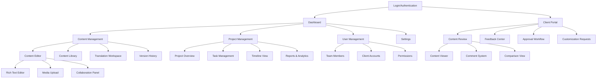
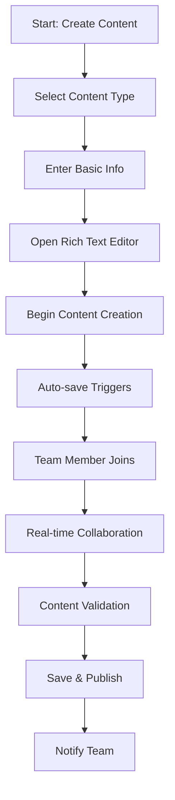
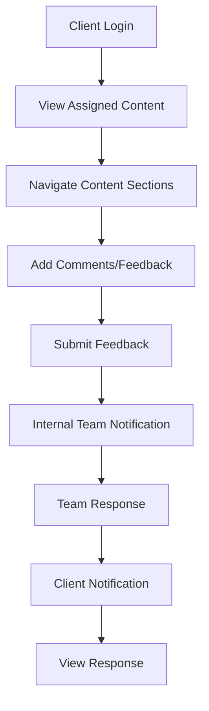
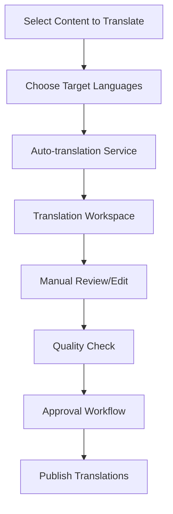

# Course Tracker UI/UX Specification

## Introduction

This document defines the user experience goals, information architecture, user flows, and visual design specifications for Course Tracker's user interface. It serves as the foundation for visual design and frontend development, ensuring a cohesive and user-centered experience.

### Overall UX Goals & Principles

#### Target User Personas

**Internal Composer:** Content creators who need efficient tools for creating and editing training programs with real-time collaboration capabilities. They prioritize productivity, content organization, and seamless collaboration with team members.

**Internal Principal:** Senior team members who review, approve, and provide strategic direction for training content. They need oversight capabilities, approval workflows, and clear visibility into project progress and team productivity.

**External Client:** Corporate clients who review content, provide feedback, and approve training programs. They need intuitive interfaces for content review, clear feedback mechanisms, and visibility into customization options.

**System Administrator:** Technical staff who manage user accounts, system configuration, and client onboarding. They need comprehensive control panels and system management capabilities.

#### Usability Goals

- **Ease of learning:** New users can complete core tasks within 5 minutes of platform access
- **Efficiency of use:** Power users can create and edit content with minimal clicks and interruptions
- **Error prevention:** Clear validation, confirmation dialogs, and auto-save prevent data loss
- **Memorability:** Infrequent users can return and navigate without relearning basic functions
- **Collaboration efficiency:** Real-time collaboration feels natural and doesn't disrupt workflow
- **Client engagement:** External clients can provide meaningful feedback without training

#### Design Principles

1. **Clarity over cleverness** - Prioritize clear communication and intuitive interfaces over aesthetic innovation
2. **Progressive disclosure** - Show only what's needed when it's needed, hide advanced features until required
3. **Consistent patterns** - Use familiar UI patterns throughout the application for all user types
4. **Immediate feedback** - Every action should have a clear, immediate response with appropriate loading states
5. **Accessible by default** - Design for all users from the start, not as an afterthought
6. **Context-aware interfaces** - Adapt the interface based on user role and current task
7. **Collaboration-first** - Design interfaces that naturally support real-time collaboration

### Change Log
| Date | Version | Description | Author |
|------|---------|-------------|---------|
| 2025-01-25 | 1.0 | Initial UI/UX specification | UX Expert |

## Information Architecture (IA)

### Site Map / Screen Inventory

### Navigation Structure

**Primary Navigation:** Role-based navigation that adapts to user type (Internal vs Client). Internal users see: Dashboard, Content, Projects, Users, Settings. Client users see: My Projects, Content Review, Feedback, Account.

**Secondary Navigation:** Context-sensitive navigation within each major section. Content section includes: Editor, Library, Translations, History. Project section includes: Overview, Tasks, Timeline, Reports.

**Breadcrumb Strategy:** Clear breadcrumb navigation showing current location within the content hierarchy, especially important for deep content structures and multi-language content.

## User Flows

### Content Creation and Collaboration Flow

**User Goal:** Create new training content with real-time team collaboration

**Entry Points:** Dashboard "Create New Content" button, Content Library "Add Content" action

**Success Criteria:** Content is created, saved, and team members can collaborate in real-time

#### Flow Diagram

#### Edge Cases & Error Handling:
- Network disconnection during editing (offline mode with sync)
- Simultaneous edits to same section (conflict resolution)
- Large file uploads (progress indicators and chunked upload)
- Browser compatibility issues (graceful degradation)
- Session timeout (auto-save and re-authentication)

**Notes:** This flow prioritizes seamless collaboration and data persistence

### Client Review and Feedback Flow

**User Goal:** Review training content and provide structured feedback

**Entry Points:** Email invitation link, Client Portal dashboard

**Success Criteria:** Client can view content, add comments, and submit feedback

#### Flow Diagram

#### Edge Cases & Error Handling:
- Client access to wrong content (permission validation)
- Feedback submission failures (retry mechanism)
- Large content loading (progressive loading)
- Mobile device limitations (responsive design)
- Comment threading issues (clear hierarchy)

**Notes:** This flow emphasizes client ease-of-use and clear communication

### Translation Workflow

**User Goal:** Translate content to multiple languages with quality control

**Entry Points:** Content Editor "Translate" action, Translation Workspace

**Success Criteria:** Content is translated, reviewed, and approved for all target languages

#### Flow Diagram

#### Edge Cases & Error Handling:
- Translation service failures (fallback options)
- Poor translation quality (manual override)
- Large content volumes (batch processing)
- Language-specific formatting (preserve structure)
- Review deadline management (escalation)

**Notes:** This flow balances automation with quality control

## Wireframes & Mockups

**Primary Design Files:** [To be created in Figma - Course Tracker Design System]

### Key Screen Layouts

#### Dashboard (Internal Users)
**Purpose:** Central hub for all internal team activities and project overview

**Key Elements:**
- Project status cards with progress indicators
- Recent activity feed
- Quick action buttons (Create Content, View Projects)
- Team collaboration status
- Notification center

**Interaction Notes:** Real-time updates, drag-and-drop project organization, contextual quick actions

**Design File Reference:** [Figma Frame: Dashboard-Desktop]

#### Content Editor
**Purpose:** Main workspace for creating and editing training content with real-time collaboration

**Key Elements:**
- Rich text editor with formatting toolbar
- Real-time collaboration indicators
- Comment sidebar
- Version history panel
- Auto-save status indicator

**Interaction Notes:** Live cursor positions, conflict resolution UI, collaborative editing tools

**Design File Reference:** [Figma Frame: Content-Editor]

#### Client Portal Dashboard
**Purpose:** Client-focused interface for reviewing content and providing feedback

**Key Elements:**
- Assigned content list
- Review progress indicators
- Feedback submission forms
- Approval workflow status
- Communication center

**Interaction Notes:** Simplified navigation, clear call-to-action buttons, progress tracking

**Design File Reference:** [Figma Frame: Client-Dashboard]

## Component Library / Design System

**Design System Approach:** Create a custom design system based on Mindstretchers Ltd. branding with components optimized for collaborative content creation and client engagement.

### Core Components

#### Content Editor
**Purpose:** Rich text editing with real-time collaboration capabilities

**Variants:** Full editor, inline editor, comment editor

**States:** Idle, editing, collaborating, saving, error, offline

**Usage Guidelines:** Use for all content creation and editing, ensure real-time indicators are visible, provide clear save states

#### Collaboration Indicator
**Purpose:** Show real-time collaboration status and user presence

**Variants:** User avatars, cursor positions, editing indicators, typing indicators

**States:** Active, idle, disconnected, conflict

**Usage Guidelines:** Always visible during collaboration, use consistent colors for different users, provide clear conflict resolution

#### Comment System
**Purpose:** Threaded commenting and feedback collection

**Variants:** Inline comments, sidebar comments, feedback forms, approval comments

**States:** New, replied, resolved, archived

**Usage Guidelines:** Use for all feedback collection, maintain clear threading, provide resolution workflow

#### Content Card
**Purpose:** Display content items in lists and grids

**Variants:** List view, grid view, compact view, detailed view

**States:** Draft, in review, approved, published, archived

**Usage Guidelines:** Use consistent layouts, show clear status indicators, provide quick actions

## Branding & Style Guide

**Brand Guidelines:** [Link to Mindstretchers Ltd. brand guidelines]

### Color Palette
| Color Type | Hex Code | Usage |
|------------|----------|-------|
| Primary | #2563EB | Main brand color, primary buttons, links |
| Secondary | #64748B | Secondary actions, supporting text |
| Accent | #F59E0B | Highlights, warnings, important notices |
| Success | #10B981 | Positive feedback, confirmations, success states |
| Warning | #F59E0B | Cautions, important notices, pending states |
| Error | #EF4444 | Errors, destructive actions, validation errors |
| Neutral | #F8FAFC, #E2E8F0, #64748B, #1E293B | Backgrounds, borders, text, surfaces |

### Typography

#### Font Families
- **Primary:** Inter (clean, modern, excellent readability)
- **Secondary:** Inter (consistent with primary)
- **Monospace:** JetBrains Mono (code, technical content)

#### Type Scale
| Element | Size | Weight | Line Height |
|---------|------|--------|-------------|
| H1 | 2.25rem (36px) | 700 | 1.2 |
| H2 | 1.875rem (30px) | 600 | 1.3 |
| H3 | 1.5rem (24px) | 600 | 1.4 |
| Body | 1rem (16px) | 400 | 1.5 |
| Small | 0.875rem (14px) | 400 | 1.4 |

### Iconography
**Icon Library:** Heroicons (consistent with Tailwind CSS)

**Usage Guidelines:** Use outline style for primary actions, solid style for active states, maintain consistent sizing (20px, 24px, 32px)

### Spacing & Layout
**Grid System:** 12-column grid with 24px gutters, 8px base unit

**Spacing Scale:** 4px, 8px, 12px, 16px, 24px, 32px, 48px, 64px, 96px, 128px

## Accessibility Requirements

### Compliance Target
**Standard:** WCAG 2.1 AA compliance

### Key Requirements

**Visual:**
- Color contrast ratios: Minimum 4.5:1 for normal text, 3:1 for large text
- Focus indicators: Clear 2px outline with sufficient contrast
- Text sizing: Minimum 16px base font size, scalable to 200%

**Interaction:**
- Keyboard navigation: All interactive elements accessible via keyboard
- Screen reader support: Proper ARIA labels and semantic HTML
- Touch targets: Minimum 44px touch target size

**Content:**
- Alternative text: Descriptive alt text for all images
- Heading structure: Logical heading hierarchy (H1-H6)
- Form labels: Clear, descriptive labels for all form inputs

### Testing Strategy
Regular accessibility testing using automated tools (axe-core) and manual testing with screen readers (NVDA, JAWS) and keyboard-only navigation.

## Responsiveness Strategy

### Breakpoints
| Breakpoint | Min Width | Max Width | Target Devices |
|------------|-----------|-----------|----------------|
| Mobile | 320px | 767px | Smartphones, small tablets |
| Tablet | 768px | 1023px | Tablets, small laptops |
| Desktop | 1024px | 1439px | Laptops, desktop monitors |
| Wide | 1440px | - | Large monitors, ultrawide displays |

### Adaptation Patterns

**Layout Changes:** 
- Mobile: Single column layout, collapsible navigation, stacked content cards
- Tablet: Two-column layout, persistent sidebar navigation, grid content display
- Desktop: Multi-column layout, full sidebar navigation, detailed content views

**Navigation Changes:**
- Mobile: Hamburger menu, bottom navigation for primary actions
- Tablet: Collapsible sidebar, tab-based navigation
- Desktop: Full sidebar navigation, breadcrumb trails

**Content Priority:**
- Mobile: Essential content first, progressive disclosure for advanced features
- Tablet: Balanced content and navigation, contextual actions
- Desktop: Full feature set, comprehensive information display

**Interaction Changes:**
- Mobile: Touch-optimized interactions, swipe gestures, large touch targets
- Tablet: Hybrid touch and mouse interactions, hover states
- Desktop: Full mouse and keyboard interactions, hover effects

## Animation & Micro-interactions

### Motion Principles
- **Purposeful:** Every animation serves a functional purpose
- **Smooth:** 60fps animations with appropriate easing
- **Accessible:** Respect user's motion preferences
- **Consistent:** Use consistent timing and easing across the platform

### Key Animations
- **Page Transitions:** 300ms ease-in-out for smooth navigation
- **Button Hover:** 150ms ease-out for interactive feedback
- **Loading States:** 1000ms ease-in-out for content loading
- **Real-time Updates:** 200ms ease-out for live collaboration indicators
- **Modal Appearance:** 250ms ease-out with backdrop fade
- **Content Saving:** 400ms ease-in-out for auto-save confirmation

## Performance Considerations

### Performance Goals
- **Page Load:** < 2 seconds for initial page load
- **Interaction Response:** < 100ms for user interactions
- **Animation FPS:** 60fps for all animations and transitions

### Design Strategies
- Optimize images and media for web delivery
- Use progressive loading for large content
- Implement skeleton screens for loading states
- Minimize layout shifts during content loading
- Use efficient animations that don't block the main thread

## Next Steps

### Immediate Actions
1. Create detailed wireframes in Figma based on this specification
2. Develop component library with all defined components
3. Create responsive prototypes for key user flows
4. Conduct usability testing with target user personas
5. Refine design based on testing feedback

### Design Handoff Checklist
- [x] All user flows documented
- [x] Component inventory complete
- [x] Accessibility requirements defined
- [x] Responsive strategy clear
- [x] Brand guidelines incorporated
- [x] Performance goals established
- [ ] Visual designs created in Figma
- [ ] Interactive prototypes developed
- [ ] Usability testing completed
- [ ] Developer handoff documentation prepared
